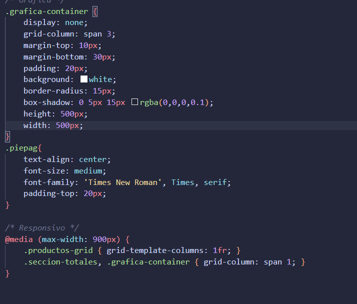
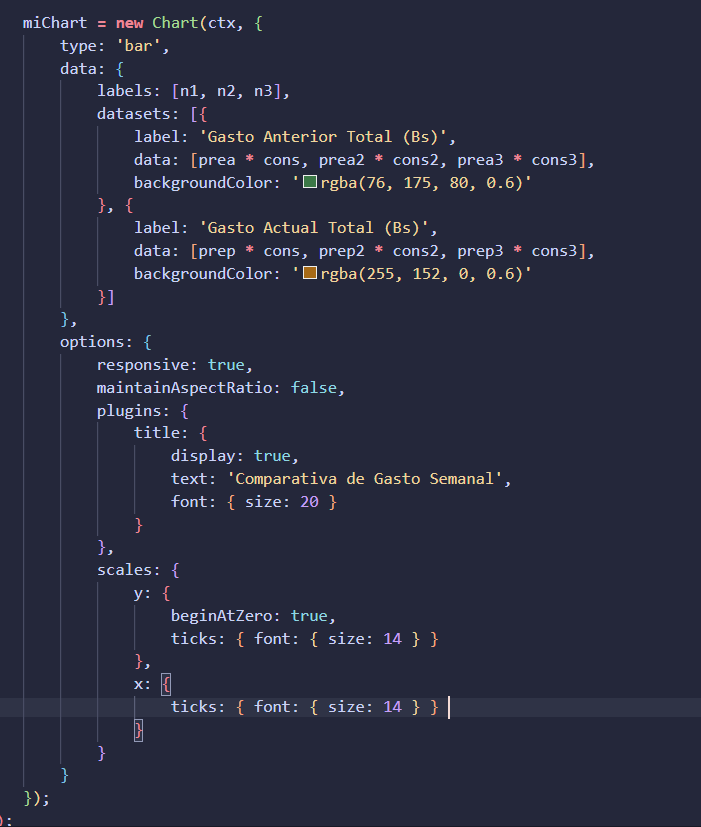
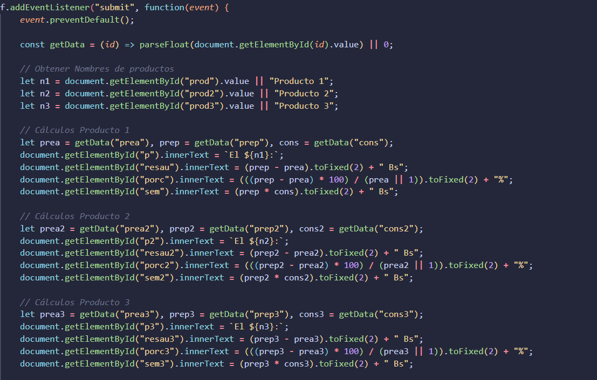
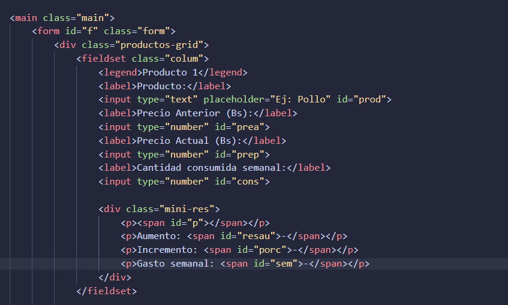

# 🛒 Aumento en la Canasta Familiar (Bolivia)

Debido a la coyuntura económica actual del país, nace la necesidad de crear una herramienta que permita calcular el aumento real en los precios de los productos básicos. Esta página web ayuda a las familias bolivianas a regular su presupuesto semanal de forma sencilla.

El sistema permite calcular e interactuar con **hasta 3 productos de manera simultánea**, ofreciendo una aproximación realista de los gastos y variaciones de precio en el mercado local.

---

## 🚀 Características Principales

* **Cálculo de Incremento:** Determina la diferencia exacta en Bs (Bolivianos) entre el precio anterior y el actual.
* **Análisis Porcentual:** Muestra el porcentaje de aumento respecto al precio base de cada producto.
* **Proyección Semanal:** Calcula el gasto total de la semana según el nivel de consumo ingresado.
* **Comparativa Global:** Suma todos los productos para mostrar un balance del gasto semanal anterior frente al gasto semanal actual.
* **Gráfica Interactiva:** Representación visual de los datos ingresados para un mejor análisis financiero.

---

## 🛠️ Tecnologías Utilizadas

* **HTML5:** Estructuración semántica utilizando contenedores `<div>` para la organización del contenido, además de formularios (`<form>` e `<input>`) para la recolección limpia de datos.
* **CSS3:** Diseño responsivo adaptado para celulares y tablets mediante el uso de **@Media**, **Flexbox** y **CSS Grid**. Se aplicó una paleta de colores claros para garantizar una lectura cómoda.
* **JavaScript (Vanilla):** Lógica de la pagina mediante funciones para los cálculos matemáticos, manipulación del DOM con `document.getElementById()` e inserción de resultados en tiempo real con `.innerText`.
* **Librerías Externas:** Integración de una librería para la generación dinámica de gráficos basados en los datos del usuario.

---

## 📖 Modo de Uso

La interfaz es intuitiva y fácil de entender. Para realizar un cálculo, sigue estos pasos:

1. Ingresa el nombre de hasta 3 productos de la canasta familiar.
2. Introduce el **precio anterior**, el **precio actual** y el **consumo semanal** estimado para cada uno.
3. El sistema procesará los datos automáticamente para mostrarte los incrementos individuales y la comparativa de gastos totales.

---

## 📸 Capturas de Pantalla del Codigo

### CSS para la grafica


### Gráfica de Incrementos


### Funciones del JavaScript


### HTML Estructura del Form


---

## 📂 Estructura del Proyecto

Aquí puedes describir cómo están organizados tus archivos, por ejemplo:

```text
├── index.html
├── css/
│   └── estilos.css
└── js/
    └── main.js
└── imagenes/
    └── css.png
    └── funciones.png
    └── grafico.png
    └── html.png

